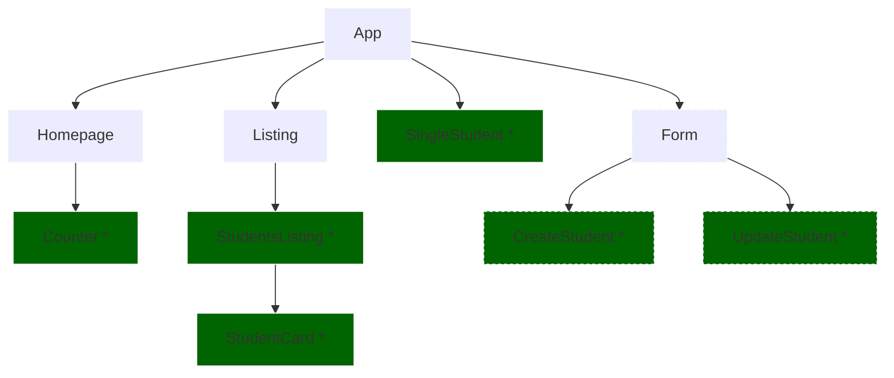

# React Exercise - Forms



### v1 - Starter Code

### v2 - New Student Page

1. AddStudent.jsx

   1. Add an AddStudent.jsx inside de src folder
   2. Add the following to the file inside the return:

   ```
    <div>
      <h1>Add Student</h1>
    </div>

   ```

2. App.jsx

   1. Add the route to the newly created page

3. Navbar.jsx

   1. Add a Navlink to the add new students
   2. Add the following to the className

   ```
     className={`highlight ${({ isActive }) =>
            isActive ? " active" : ""}`}
   ```

   3. Add the end prop to the /students NavLink

4. Navbar.css

   1. Add the following to the bottom of the page:

   ```
   nav .highlight {
       background-color: #646cff;
       color: #fff;
       padding: 6px 12px;
       border-radius: 6px;
    }

    nav .highlight::before {
       content: unset;
    }

    nav .highlight:hover {
       background-color: #535bf2;
       color: #fff;
    }

   ```

### v3 - Add Form to New Student Page

1. AddStudent.jsx:
   1. Replace the return with the following:
   ```
   <div>
     <h1>Add Student</h1>
     <form>
       <div className="input-wrapper">
         <label>Name:</label>
         <input
           type="text"
           name="name"
           value={name}
           onChange={handleNameChange}
         />
       </div>
       <div className="input-wrapper">
         <label>Image URL:</label>
         <input
           type="text"
           name="imgURL"
           value={imgURL}
           onChange={handleImgChange}
         />
       </div>
       <div className="input-wrapper">
         <label>Age:</label>
         <input
           type="number"
           name="age"
           value={age}
           onChange={handleAgeChange}
         />
       </div>
       <div className="input-wrapper">
         <label>Bootcamp:</label>
         <div className="select-wrapper">
           <select name="bootcamp" value={bootcamp} onChange={handleBootcampChange}>
             <option value="">Select a bootcamp</option>
             <option value="Web Development">Web Development</option>
             <option value="UX/UI Design">UX/UI Design</option>
             <option value="Data Analytics">Data Analytics</option>
           </select>
         </div>
       </div>
       <button type="submit">Save</button>
     </form>
   </div>
   ```
   2. Create state for name, imgURL, age and bootcamp
   3. Create the functions to handle the changes in name, imgURL, age and bootcamp
      1. handleNameChange:
      ```
        const handleNameChange = (e) => {
            setName(e.target.value);
        };
      ```
      2. handleImgChange:
      ```
        const handleImgChange = (e) => {
            setImgURL(e.target.value);
        };
      ```
      3. handleAgeChange:
      ```
        const handleAgeChange = (e) => {
            const value = Number(e.target.value) || "";
            if (value < 0) return;
            setAge(value);
        };
      ```
      4. handleBootcampChange:
      ```
        const handleBootcampChange = (e) => {
            setBootcamp(e.target.value);
        };
      ```
2. AddStudent.css:

   1. Create the file
   2. Add the following to the file:

   ```
   form {
       display: flex;
       flex-direction: column;
       justify-content: center;
       align-items: center;
       background-color: #1a1a1a;
       max-width: 400px;
       margin: 0 auto;
       border-radius: 20px;
       padding: 40px;
   }

   form .input-wrapper {
       width: 100%;
       display: flex;
       flex-direction: column;
       gap: 10px;
   }

   form .select-wrapper {
       width: 100%;
       display: flex;
       flex-direction: column;
       gap: 10px;
   }

   form .select-wrapper {
       position: relative;
       width: 100%;
       height: 100%;
   }

   form .select-wrapper::after {
       content: "▼";
       font-size: 1rem;
       top: 6px;
       right: 10px;
       position: absolute;
       color: #1a1a1a;
   }

   form label {
       color: white;
       font-size: 14px;
   }

   form input {
       padding: 10px;
       border-radius: 10px;
       border: none;
       background-color: white;
       color: #1a1a1a;
       margin-bottom: 20px;
   }

   input[type="number"] {
       position: relative;
       border: 1px solid #bbb;
       border-color: #bbb #ececec #ececec #bbb;
       margin-bottom: 20px;
   }

   input[type="number"]::-webkit-outer-spin-button,
   input[type="number"]::-webkit-inner-spin-button {
       -webkit-appearance: none;
       background: #fff
           url(data:image/png;base64,iVBORw0KGgoAAAANSUhEUgAAAAkAAAAJCAYAAADgkQYQAAAAKUlEQVQYlWNgwAT/sYhhKPiPT+F/LJgEsHv37v+EMGkmkuImoh2NoQAANlcun/q4OoYAAAAASUVORK5CYII=)
           no-repeat center center;
       width: 25px;
       border-left: 1px solid #bbb;
       opacity: 0.5;
       position: absolute;
       top: 0;
       right: 0;
       bottom: 0;
   }

   input[type="number"]::-webkit-inner-spin-button:hover,
   input[type="number"]::-webkit-inner-spin-button:active {
       box-shadow: 0 0 2px #0cf;
       opacity: 0.8;
   }

   form select {
       -webkit-appearance: none;
       appearance: none;
       background-color: white;
       color: #1a1a1a;
       padding: 10px;
       margin-bottom: 20px;
       border-radius: 10px;
   }

   form button {
       padding: 10px;
       width: 100%;
       border-radius: 10px;
       border: none;
       background-color: #646cff;
       color: white;
       font-size: 16px;
       cursor: pointer;
   }

   form button:hover {
       background-color: #535bf2;
   }
   ```

### v4 - createStudent function

1. App.jsx
   1. Create the createStudent function:
   ```
    const createStudent = (student) => {
        setStudents([...students, student]);
    };
   ```
   2. Pass the funtion as props to the AddStudent component
2. AddStudent.jsx:

   1. Accept the createStudent prop
   2. Create a handleSubmit function:

   ```
    const handleSubmit = (e) => {
        e.preventDefault();

        // Check if all fields are filled
        if (!name || !age || !bootcamp) {
            alert("Please fill in all fields");
            return;
        }

        // generate id, if no image default image is used & add student to the list
        const id = uuidv4();
        const img = imgURL || defaultImg;
        createStudent({ id, name, img, age, bootcamp });

        // clear form
        setName("");
        setAge(0);
        setBootcamp("");

        // redirect to students list
        navigate("/students");
    };
   ```

   3. Import uuid and useNavigate
   4. Initialize useNavigate in a variable called navigate
   5. Add the function to the onClick event in the button

### v5 - Update Student Page

1. UpdateStudent.jsx

   1. Add an UpdateStudent.jsx inside de src folder
   2. Add the following to the file inside the return:

   ```
    <div>
      <h1>Update Student</h1>
    </div>

   ```

2. App.jsx
   1. Import UpdateStudent
   2. Create a Route to edit a student:
   ```
   <Route
        path="/students/:studentId/edit"
        element={<UpdateStudent />}
    />
   ```
3. StudentCard.jsx
   1. Replace the return content with:
   ```
   <li className="card">
     <Link to={`/students/${student.id}?showAge=true&showBootcamp=true`}>
       {student.name}
     </Link>
     <div style={{ display: "flex", alignItems: "center" }}>
       <Link className="button" to={`/students/${student.id}/edit`}>
         ✏️
       </Link>
       <button onClick={() => deleteItem(student.id)}>🗑️</button>
     </div>
   </li>
   ```

### v6 - Add Form to Update Student Page

1. UpdateStudent.css

   1. Create an UpdateStudent.css
   2. Copy the content from AddStudent.css file

2. UpdateStudent.jsx

   1. Import useState from react
   2. Import useParams, Navigate and useNavigate from react-router-dom
   3. Destructure studentId from params
   4. Add the state and the handle functions:

   ```
    const [name, setName] = useState(student.name);
    const [imgURL, setImgURL] = useState(student.img);
    const [age, setAge] = useState(student.age);
    const [bootcamp, setBootcamp] = useState(student.bootcamp);
    const navigate = useNavigate();

    const handleNameChange = (e) => {
        setName(e.target.value);
    };

    const handleImgChange = (e) => {
        setImgURL(e.target.value);
    };

    const handleAgeChange = (e) => {
        const value = Number(e.target.value) || "";
        if (value < 0) return;
        setAge(value);
    };

    const handleBootcampChange = (e) => {
        setBootcamp(e.target.value);
    };
   ```

   5. Add the handleSubmit function:

   ```
     const handleSubmit = (e) => {
       e.preventDefault();

       // Check if all fields are filled
       if (!name || !age || !bootcamp) {
       alert("Please fill in all fields");
       return;
       }

       const updatedStudents = students.map((student) => {
       if (student.id === studentId) {
           return { id: studentId, name, img: imgURL, age, bootcamp };
       }
       return student;
       });

       // update student in the list
       setStudents(updatedStudents);

       // redirect to students list
       navigate("/students");
   };
   ```

   6. Add the following to the return:

   ```
       <div>
      <h1>Add Student</h1>
      <form>
        <div className="input-wrapper">
          <label>Name:</label>
          <input
            type="text"
            name="name"
            value={name}
            onChange={handleNameChange}
          />
        </div>
        <div className="input-wrapper">
          <label>Image URL:</label>
          <input
            type="text"
            name="imgURL"
            value={imgURL}
            onChange={handleImgChange}
          />
        </div>
        <div className="input-wrapper">
          <label>Age:</label>
          <input
            type="number"
            name="age"
            value={age}
            onChange={handleAgeChange}
          />
        </div>
        <div className="input-wrapper">
          <label>Bootcamp:</label>
          <div className="select-wrapper">
            <select
              name="bootcamp"
              value={bootcamp}
              onChange={handleBootcampChange}
            >
              <option value="">Select a bootcamp</option>
              <option value="Web Development">Web Development</option>
              <option value="UX/UI Design">UX/UI Design</option>
              <option value="Data Analytics">Data Analytics</option>
            </select>
          </div>
        </div>
        <button type="submit" onClick={handleSubmit}>
          Save
        </button>
      </form>
    </div>
   ```

### v7 - BONUS - Filter Students by Bootcamp in the Students List

1. StudenstList.jsx
   1. Import useState
   2. Create a category state, initial state to be an empty string
   3. Create a function that handles the selection of categories
   ```
     const handleCategoryFilter = (e) => {
        setCategory(e.target.value);
    };
   ```
   4. Replace the content inside return with the following:
   ```
   <div className="wrapper">
      <div style={{ display: "flex", alignItems: "center", gap: "10px" }}>
        <h5>Filter by Bootcamp:</h5>
        <div className="category-select-wrapper">
          <select name={category} onChange={handleCategoryFilter}>
            <option value="">All</option>
            <option value="Web Development">Web Development</option>
            <option value="UX/UI Design">UX/UI Design</option>
            <option value="Data Analytics">Data Analytics</option>
          </select>
        </div>
      </div>
      <ul>
        {students.map((student) => {
          if (category === "" || student.bootcamp === category) {
            return (
              <StudentCard
                key={student.id}
                student={student}
                deleteItem={deleteItem}
              />
            );
          }
        })}
      </ul>
    </div>
   ```
2. StudentsList.css

   1. Add the following to the end of the file:

   ```
   .category-select-wrapper {
       display: flex;
       flex-direction: column;
       gap: 10px;
       position: relative;
       min-width: 200px;
   }

   .category-select-wrapper::after {
       content: "▼";
       font-size: 1rem;
       top: 6px;
       right: 10px;
       position: absolute;
       color: #1a1a1a;
   }

   .category-select-wrapper select {
       -webkit-appearance: none;
       appearance: none;
       background-color: white;
       color: #1a1a1a;
       padding: 10px;
       border-radius: 10px;
   }

   ```
